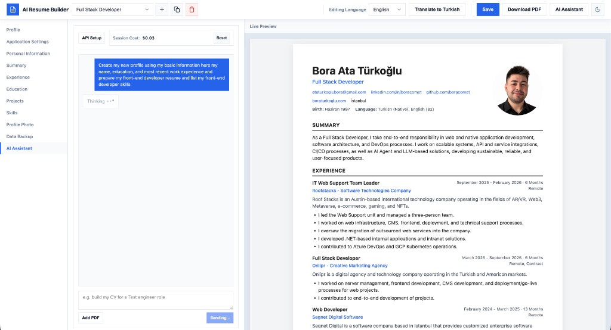
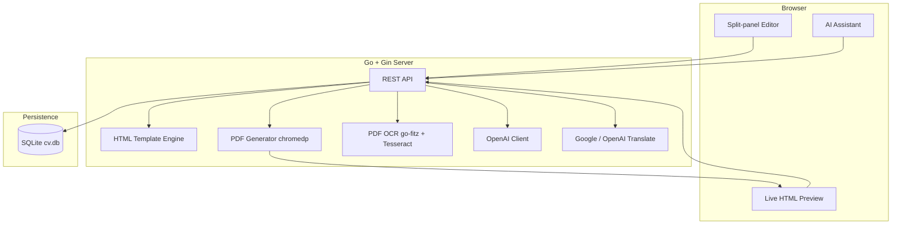

# AI Resume Builder

**Open-source, AI-powered ATS resume builder with live preview and PDF export.**

[](https://go.dev/)
[](https://gin-gonic.com/)
[](https://www.sqlite.org/)
[](https://openai.com/)
[](https://www.docker.com/)
[](LICENSE)

Build professional, ATS-friendly resumes in your browser. Edit with a split-panel UI, switch between Turkish and English content, chat with an AI assistant, translate profiles, import legacy PDFs via OCR, and export polished PDFs — all self-hosted.

> **Demo profile:** On first launch, a **Full Stack Developer** sample profile (TR + EN) is seeded so you can explore features immediately. Personal details are demo placeholders; phone is left empty.

<!-- Screenshots: add images to docs/screenshots/ and uncomment -->
<!--  -->

## Features

- **Live preview** — Split-panel editor with 300ms debounced HTML preview
- **ATS-friendly template** — Single-column layout optimized for applicant tracking systems
- **Multi-profile** — Manage multiple resumes in SQLite (`data/cv.db`)
- **Bilingual CVs** — Turkish / English content slots with localized section labels
- **UI localization** — Application interface in Turkish or English (separate from CV content language)
- **PDF export** — Headless Chrome via `chromedp`
- **AI assistant** — OpenAI-powered chat to create and edit CV content
- **Translation** — Google Translate or OpenAI for one-click profile translation
- **PDF OCR** — Upload scanned PDFs to the AI chat; text extraction runs locally (no OpenAI cost)
- **JSON backup & restore** — Export/import single profiles or full backups (`merge` / `replace`)
- **Dark mode** — Light and dark themes
- **Docker** — One-command deployment with Chromium and Tesseract included

## Architecture



| Layer | Technology |
|-------|------------|
| Backend | Go, Gin |
| Database | SQLite (`modernc.org/sqlite`) |
| PDF | chromedp + Chromium |
| OCR | go-fitz + Tesseract CLI |
| AI | OpenAI Chat Completions |
| Frontend | Vanilla HTML/CSS/JS |

## Quick Start

### Docker (recommended)

```bash
git clone https://github.com/boracomet/ai-resume-builder.git
cd ai-resume-builder
cp .env.example .env
# Edit .env with your API keys (optional for basic editing)
docker compose up --build
```

Open [http://localhost:8080](http://localhost:8080). Data persists in the `cv-data` Docker volume.

The image includes Chromium (`CHROME_PATH=/usr/bin/chromium-browser`) and Tesseract (Turkish + English) for PDF export and OCR.

### Local development

**Requirements:** Go 1.22+, Chrome or Chromium (PDF export). Optional: Tesseract for scanned PDF OCR.

```bash
git clone https://github.com/boracomet/ai-resume-builder.git
cd ai-resume-builder
cp .env.example .env
go mod tidy
go run ./cmd/server
```

**macOS — Tesseract (scanned PDFs only):**

```bash
brew install tesseract tesseract-lang
```

**Linux (Debian/Ubuntu):**

```bash
sudo apt install tesseract-ocr tesseract-ocr-tur tesseract-ocr-eng
```

## Environment Variables

Copy `.env.example` to `.env`. Variables are loaded automatically via `godotenv` at startup.

| Variable | Default | Description |
|----------|---------|-------------|
| `PORT` | `8080` | HTTP server port |
| `CV_DB_PATH` | `data/cv.db` | SQLite database path |
| `GOOGLE_TRANSLATE_API_KEY` | — | Google Cloud Translation API key |
| `OPENAI_API_KEY` | — | OpenAI API key (AI assistant + OpenAI translation) |
| `OPENAI_DEFAULT_MODEL` | `gpt-4o-mini` | Default OpenAI model when not set in the UI |
| `GOOGLE_GEMINI_API_KEY` | — | Planned — not used yet |
| `XIAOMI_API_KEY` | — | Planned — not used yet |
| `CHROME_PATH` | — | Chrome/Chromium binary path (auto-set in Docker) |

API keys can also be entered in the editor UI; browser `localStorage` values take precedence over server env vars.

## API Summary

| Method | Path | Description |
|--------|------|-------------|
| GET | `/` | Editor UI |
| GET | `/api/profiles` | List profiles |
| POST | `/api/profiles` | Create profile |
| GET | `/api/profiles/:id` | Get profile |
| PUT | `/api/profiles/:id` | Update profile |
| DELETE | `/api/profiles/:id` | Delete profile |
| POST | `/api/profiles/:id/duplicate` | Duplicate profile |
| POST | `/api/profiles/:id/copy-from/:sourceId` | Copy content from another profile |
| POST | `/api/profiles/:id/photo` | Upload profile photo |
| POST | `/api/profiles/:id/translate` | Translate profile (Google or OpenAI) |
| GET | `/api/profiles/:id/export` | Download single profile as JSON |
| GET | `/api/export` | Download all profiles as JSON backup |
| POST | `/api/import` | Import JSON backup (`merge` or `replace`) |
| GET | `/api/settings` | API key configuration status (values not returned) |
| POST | `/api/preview` | JSON → HTML preview |
| POST | `/api/pdf` | JSON → PDF download |
| GET | `/api/ai/models` | List OpenAI chat models |
| POST | `/api/ai/test` | Test OpenAI connection |
| POST | `/api/ai/chat` | AI chat (create/edit CV) |
| POST | `/api/ai/apply` | Apply AI suggestion to profile |
| POST | `/api/ocr/pdf` | Extract text from PDF (multipart `file`, max 10 MB) |

### Import / export

**Export single profile:** `GET /api/profiles/:id/export` — returns JSON with `Content-Disposition: attachment`.

**Export all:** `GET /api/export` — full backup with `version`, `app`, `exportedAt`, and `profiles[]`.

**Import:** `POST /api/import` with JSON body:

```json
{
  "mode": "merge",
  "profiles": [ ... ]
}
```

- `merge` (default) — append profiles; name conflicts get an ` (import)` suffix
- `replace` — delete all existing profiles and import the backup (requires UI confirmation)

## Screenshots

See [`docs/screenshots/`](docs/screenshots/) for README images. Add captures of the editor, AI chat, and PDF preview there.

## Development

```bash
go build ./...
go test ./...
go build -o bin/ai-resume-builder ./cmd/server
```

## Contributing

Contributions are welcome! Please read [CONTRIBUTING.md](CONTRIBUTING.md) for branch workflow, testing, and PR guidelines.

## License

This project is licensed under the [MIT License](LICENSE) — Copyright (c) 2026 Bora Ata Türkoğlu.
